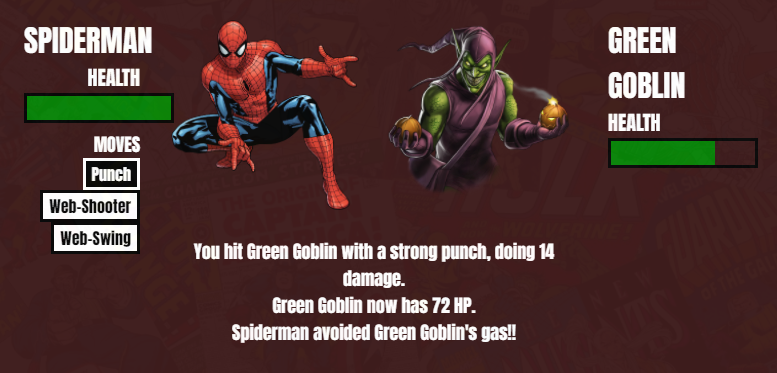
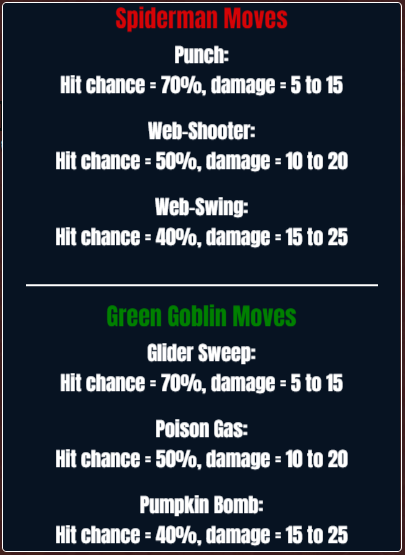
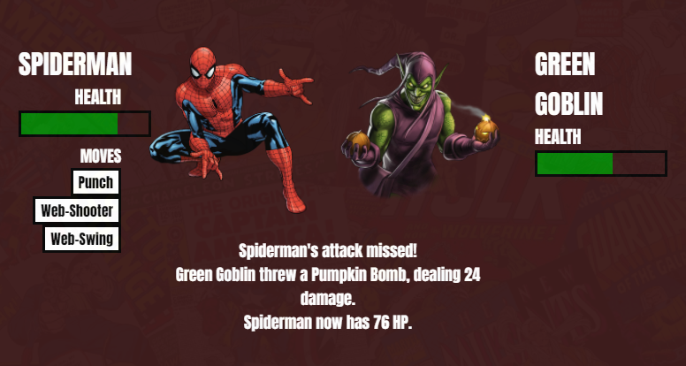
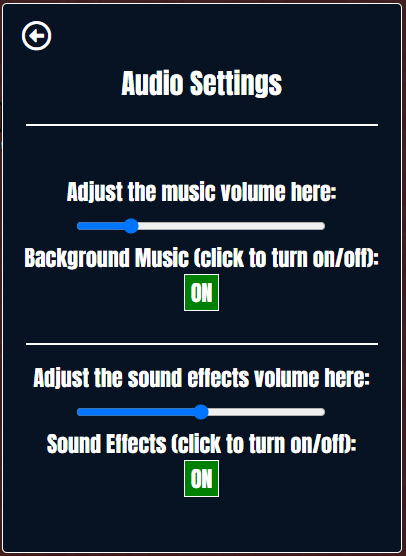
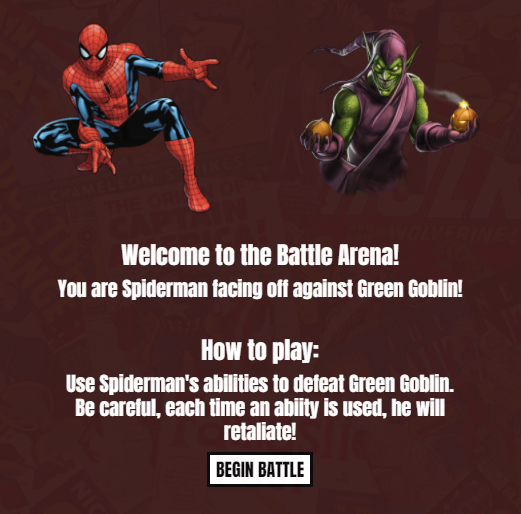
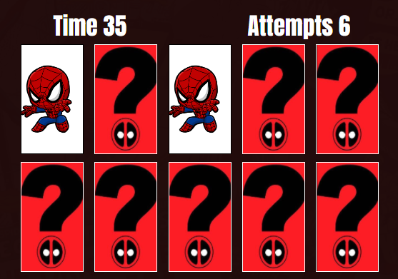
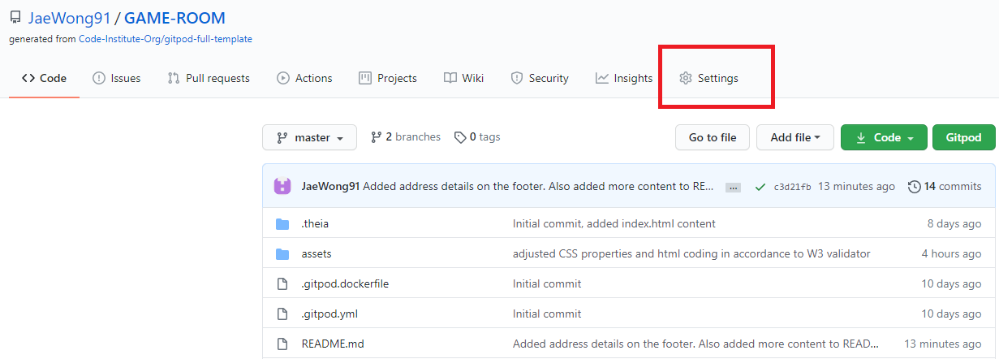

# Marvel Games Website

The website is based on the Marvel comics universe. As a fan of the Marvel universe, I wanted to base my site on this.
There are two games that users can play. They are:

1) A turn based battle game. Play as Spiderman and use his abilities to defeat his nemesis, Green Goblin. 
2) Card pair matching game. There are a total of 12 Marvel characters. Find and pair up the heroes within the time limit.

The Live Website can be found [here](https://jaewong91.github.io/MS2-Marvel-Game/)

# User Experience (UX)

## User Stories

As a visitor and a user of the website, when playing the battle game I would like to:
* Play and experience a battle/fighting game using a Marvel Hero. 
* Fight a difficult battle against a Marvel villain.
* See how effective the abilities I select in defeating the enemy.
* Understand each of my abilities available in terms of damage and hit chance.
* Understand the abilities used by the opponent and how much it affects my character.
* Adjust the music and sound settings at any time.
* Understand the game that I play with clear instructions.

As a visitor and a user of the website, when playing the card matching game I would like to:
* Play a card matching game to challenge my memory.
* Understand the game that I play with clear instructions.
* Adjust the music and sound settings at any time.

## Design

- Colour Scheme
    - For the page headings, I used red for the home page, and blue background for both Battle and Card Matching pages as well as a white font. This was to keep in line with the official Marvel logo.
    - All font colours are white, again to stick with the Marvel logo theme.
    - My modals are dark blue.
    - The background which sits in front of the back-most background is burgandy. This is applied on both Card Matching and Battle pages.
    - Orange is used for the exit button, to highlight how to return to the main page.
    - Purple is used for the audio settings button.
    - The buttons for the Battle page are black and white, this gave a classic comic book feel to them.

- Typography
    - The 'Anton' font is used throughout the whole website. This appeared to go well with the official Marvel logo font as well gave a comic book feel. 'Sans Serif' is used as a back up should the 'Anton' font fails to load.

- Wireframes
    
    The design for the wireframes were created using Balsamiq. These can be viewed [here](/readme-images/Marvel-Wireframes.pdf)
    

# Game Functionality

## Battle Game - Spiderman vs Green Goblin

* Due to the browsers now disabling autoplay of music, music will start when the user presses the "Begin Battle" button.
* Upon page load, the text will describe to that the player will be using Spiderman to fight against Green Goblin.
* The game begins by asking the player to use one of the three abilities available to Spiderman.
* Each ability has a chance to hit or miss the enemy, Green Goblin.
* Spiderman and Green Goblin have three abilities each where they have different hit chances and damage values. A high-risk high-reward principle is implemented where an ability that deals more damage, will have a lower chance to land.
* Each ability has their own animation and sound effect, for both Spiderman and Green Goblin.
* The text will advise the player of a successful attack or miss.
* If an attack successfully hits Green Goblin, the player is updated of how much damage is dealt and their current Health.
* Each time the player uses an ability, Green Goblin will retaliate with his own move.
* Each time Green Goblin attacks the player (Spiderman), text will advise the player if Spiderman avoided the attack, or when hit, how much damage was taken.
* Victory is achieved when Green Goblin's health is zero and loss when Spiderman's health reaches zero.
* Upon victory or defeat, an overlay will advise the player of their victory or loss. Simply click to replay the game.

## Card Matching Game - Marvel Heroes
* The first window describes how to play the game. There are 12 unique heroes and 24 total cards. Find and match their respective pairs in under 90 seconds.
* There is an "Attempts" counter which tracks how many times the player has flipped a card.
* On each successful matched pair, the cards will perform a zoom-in, zoom-out animation as well as play a sound effect.
* An overlay will appear once all cards are matched, or if the time has run out advising the player of a win or loss.
* Each win and loss overlay has their own sound effect.
* Simply click the overlay to replay the game.
    

## Music and sound effects
* Each page (Home page, Battle page and Card Matching page) has a modal for audio settings. The user can turn off/on music and sound effects. They can also adjust the volume.

# Technologies Used

## Languages 

-   [HTML5](https://en.wikipedia.org/wiki/HTML5)
-   [CSS3](https://en.wikipedia.org/wiki/Cascading_Style_Sheets)
-   [Javascript](https://www.javascript.com/)
-   [jQuery](https://jquery.com/)

## Frameworks, Libraries & Programs 

1. [Bootstrap v4.5.2](https://getbootstrap.com/docs/4.5/getting-started/introduction/) - Bootstrap was used to assist with the layout and display of the content.
1. [Font Awesome](https://fontawesome.com/) - Font Awesome used for the audio control and game information icons.
1. [Balsamiq](https://balsamiq.com/wireframes/?gclid=CjwKCAjwkdL6BRAREiwA-kiczJUq8U_iMFrVp1xv8FmLNPGDxIxjk-d9dlu_X88qo79PfI1VkZbcaxoC5-QQAvD_BwE) - The wire frame software used for the initial design of the website.
1. [Google Fonts](https://fonts.google.com/) - Used to apply the Anton font family.
1. [GitPod](https://www.gitpod.io/) - Git allowed version control and also to add, commit to Git and push to GitHub.
1. [Github](https://github.com/) - GitHub is used as a storage space for the project, where it can then be pushed onto Gitpod.
1. [PicResize](https://picresize.com/) - This is used to resize large images down to smaller files.
    

## Code

1. [Bootstrap 4](https://getbootstrap.com/docs/4.5/getting-started/introduction/) - Used throughout the project.
1. [Stackoverflow - Main Background image](https://stackoverflow.com/questions/23254346/how-can-i-change-background-image-opacity-without-changing-on-div-content) - Code used to apply the background image and asjust opacity independantly.
1. [Stackoverflow - Centering the modal](https://stackoverflow.com/questions/396145/how-to-vertically-center-a-div-for-all-browsers) - Used this code to center the modal.
1. [Stackoverflow - Audio controls](https://stackoverflow.com/questions/62160275/js-audio-volume-slider) - This code was used to implement audio controls such as the mute function and the volume sliders.

## Image stock sites

The below image stock websites are used to obtain most of the images for the marvel characters.

1) [hiclipart](https://www.hiclipart.com/)
2) [flyclipart](https://flyclipart.com/)
3) [clipartmax](https://www.clipartmax.com/)

## Images 

1) Marvel logo - [thebrazenbull.com](https://thebrazenbull.com/wp-content/uploads/2019/09/marvel-logo-card-1560x876_24.jpg)
2) Marvel background - [www.reddit.com/r/Marvel](https://www.reddit.com/r/Marvel/comments/23iv0s/i_couldnt_find_a_highres_marvel_background_for_my/)
3) Deadpool question mark (card-back) - [pinimg.com](https://i.pinimg.com/originals/02/fa/56/02fa56aed0377adc30d1974fb22d6e15.jpg)

## Audio sites

There were various sites where I obtained music and sound effects.

1) [freesound](https://freesound.org/) - card flip, match and sound effects.
2) [medea music](https://medea-music.com/artist-management-2/) - Avengers theme song
3) [bestringtones](https://bestringtoness.com/) - Marvel intro music
4) [mp3quack.live](https://spiderman-theme.mp3quack.live/) - spiderman movie theme
5) [zapsplat](https://www.zapsplat.com/sound-effect-categories/) - Sound effects for Green Goblin

# Testing

1. Using [W3C Markup Validator](https://validator.w3.org/) and  to ensure there were no syntax errors in the HTML code.
1. For CSS, I used [W3C CSS Validator Services](https://jigsaw.w3.org/css-validator/).
1. For Javascript, I used [jshint](https://jshint.com/) to ensure no errors in my code.
1. Testing was performed using Google Chrome's device toggle feature. These include screen sizes of small, medium and large resolutions.
1. Further tests were performed to ensure both games function as intended. Documents to show this will can be seen here.

## Testing User Stories

### Battle Game
As a visitor and a user of the website, when playing the battle game I would like to:
* Play and experience a battle/fighting game using a Marvel Hero. 
    - The user will be playing as Spiderman.
* Fight a difficult battle against a Marvel villain.
    - The villain is Green Goblin. Each time the player selects one of Spiderman's moves, he will retaliate in an attempt to defeat Spiderman.
    
* See how effective the abilities I select in defeating the enemy.
    - Each time an ability is used, there will be new text to show if Spiderman lands a hit or misses an attack. If the attack successfully lands, the game will tell the user how much damage was dealt to Green Goblin.

    

* Understand each of my abilities available in terms of damage and hit chance.
    - The information for abilities is shown in a modal as below:

    

* Understand the abilities used by the opponent and how much it affects my character.
    - Similar to how the game will inform the player of how much damage Spiderman has dealt, it will also show details of Green Goblin's attack on Spiderman.

    

* Adjust the music and sound settings at any time.
    - Each page has an audio icon that when clicked, will show the modal to adjust the music and sound effect settings.

    
    
* Adjust the music and sound settings at any time.
    - When the user loads the page, the instructions are shown by text:

    

### Card Matching Game

As a visitor and a user of the website, when playing the card matching game I would like to:
* Play a card matching game to challenge my memory.
    - The cards start as facing down where the player is tasked to remember where heroes are positioned to find the matching pairs.

    

* Understand the game that I play with clear instructions.
* Adjust the music and sound settings at any time.

## Deployment

### Github 

This project was deployed to Gitub. This is done using the following steps:

1.  Log in to GitHub and locate the Repository
2.  Click the "Settings" button. This can be found here: 
 
3.  Scroll down the page until you reach the "GitHub Pages" section.
4.  Under "Source", the default dropdown option is "None". Change this to "Master Branch".
5.  Ensure that "/ (Root)" is also selcted and then click "Save".
6.  The page will automatically refresh. Scroll down back to the "GitHub Pages" section.
7.  The website is now published where a link is provided.

## Tutorials and Credits

The below videos were used as guidelines to create the functional games.
-   Battle Game - [Youtube - Scott Blenkhorne](https://www.youtube.com/watch?v=sr8bJKSUYwE&ab_channel=ScottBlenkhorne)
-   Card Matching Game part 1 - [Youtube - 'Web Dev Simplified'](https://www.youtube.com/watch?v=28VfzEiJgy4&ab_channel=WebDevSimplified)
-   Card Matching Game part 2 - [Youtube - 'PortEXE'](https://www.youtube.com/watch?v=3uuQ3g92oPQ&ab_channel=PortEXE)

I would also like to thank my mentors, Mark Railton and Spencer Barriball for their guidance. Scott at student support has also been a huge help and I would like to thank him for being patient with me.
